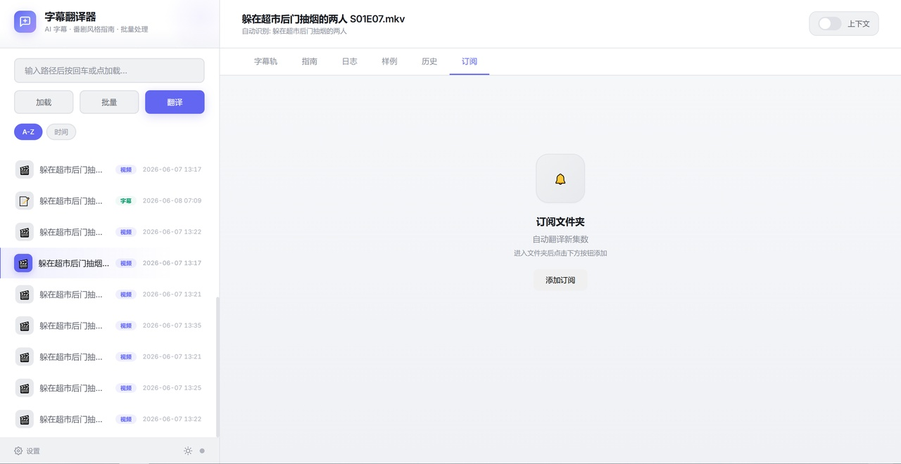

# AI字幕翻译器

自动提取视频中的英文字幕，通过 AI 翻译成中文字幕，支持番剧背景知识优化翻译质量。

## 功能特性

- **双模型协作**：V4-Pro 分析番剧生成翻译指南 + V4-Flash 批量翻译
- **番剧背景感知**：自动识别番剧名，生成角色语气/名词译法等指南
- **上下文模式**：翻译时传入前后字幕作为语境，对话更连贯
- **字幕编辑**：翻译完成后展示全部字幕，支持手动编辑和保存
- **批量翻译**：扫描文件夹，自动翻译未翻译的视频
- **文件夹订阅**：订阅文件夹后自动翻译新视频
- **Webhook 通知**：翻译完成后通知企业微信/钉钉/FastGPT
- **文件管理**：完整的文件浏览器，支持字幕上传下载

## 使用方法

1. 选择视频文件（支持 mkv/mp4/avi/mov/ts）
2. 选择英文字幕轨道
3. 点击翻译，等待完成
4. 在「样例」中查看并编辑翻译结果

## 配置

首次使用需要在设置中配置 API Key 和模型。

## 截图

